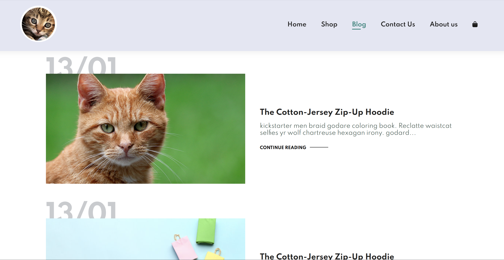
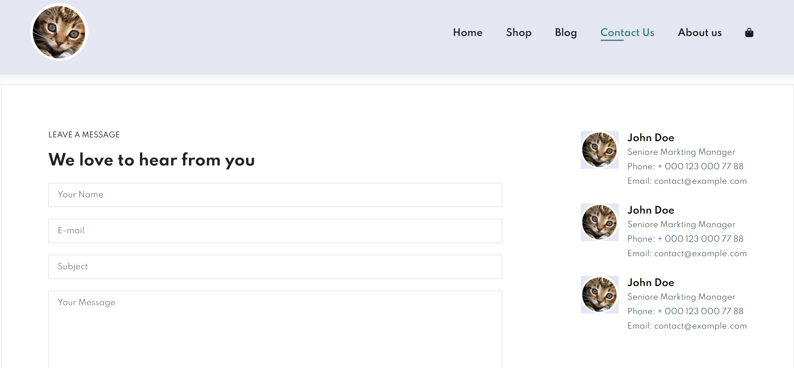
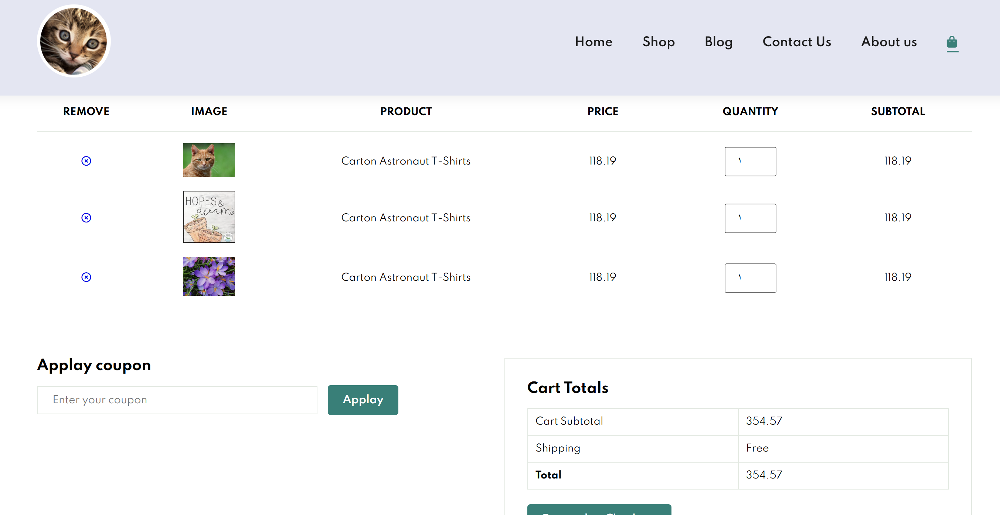

# a demu for E-Commerce Website

In this project , I'm trying to learn how to build an excellent example of an E-commerce website/app .

been following this genius guy called (Tech2etc) , he's giving an awesome guidance in his channel on youtube

you can check it by yourself, right here:
https://www.youtube.com/@Tech2etc/videos

Some screenshot of the website:

